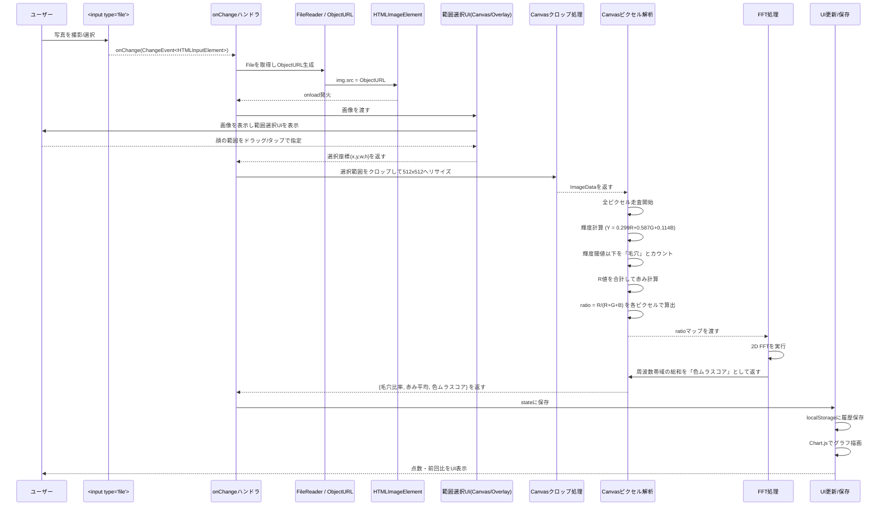

```mermaid
sequenceDiagram
    participant User as ユーザー
    participant Input as <input type="file">
    participant React as onChangeハンドラ
    participant File as FileReader / ObjectURL
    participant Img as HTMLImageElement
    participant Selector as 範囲選択UI(Canvas/Overlay)
    participant Cropper as Canvasクロップ処理
    participant Analyzer as Canvasピクセル解析
    participant FFT as FFT処理
    participant App as UI更新/保存

    User->>Input: 写真を撮影/選択
    Input-->>React: onChange(ChangeEvent<HTMLInputElement>)

    React->>File: Fileを取得しObjectURL生成
    File->>Img: img.src = ObjectURL
    Img-->>React: onload発火

    %% 追加：ユーザーによる範囲選択処理
    React ->> Selector: 画像を渡す
    Selector->>User: 画像を表示し範囲選択UIを表示
    User-->>Selector: 顔の範囲をドラッグ/タップで指定
    Selector-->>React: 選択座標(x,y,w,h)を返す

    React->>Cropper: 選択範囲をクロップして512x512へリサイズ
    Cropper-->>Analyzer: ImageDataを返す

    Analyzer->>Analyzer: 全ピクセル走査開始
    Analyzer->>Analyzer: 輝度計算 (Y = 0.299R+0.587G+0.114B)
    Analyzer->>Analyzer: 輝度閾値以下を「毛穴」とカウント
    Analyzer->>Analyzer: R値を合計して赤み計算
    Analyzer->>Analyzer: ratio = R/(R+G+B) を各ピクセルで算出
    Analyzer-->>FFT: ratioマップを渡す

    FFT->>FFT: 2D FFTを実行
    FFT->>Analyzer: 周波数帯域の総和を「色ムラスコア」として返す

    Analyzer-->>React: {毛穴比率, 赤み平均, 色ムラスコア} を返す
    React->>App: stateに保存
    App->>App: localStorageに履歴保存
    App->>App: Chart.jsでグラフ描画
    App-->>User: 点数・前回比をUI表示

```